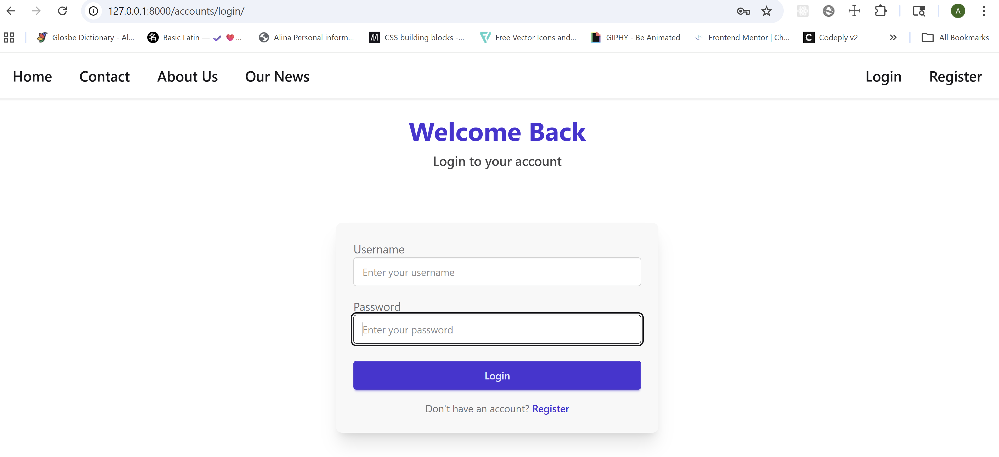
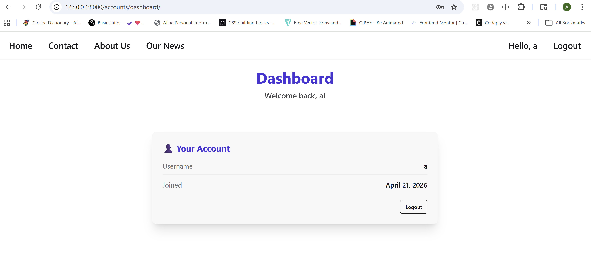
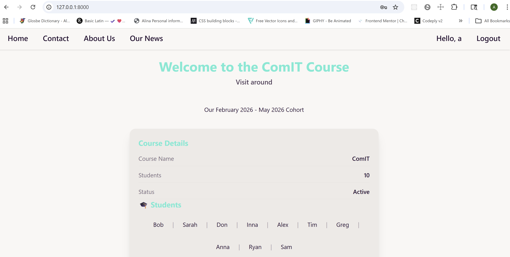
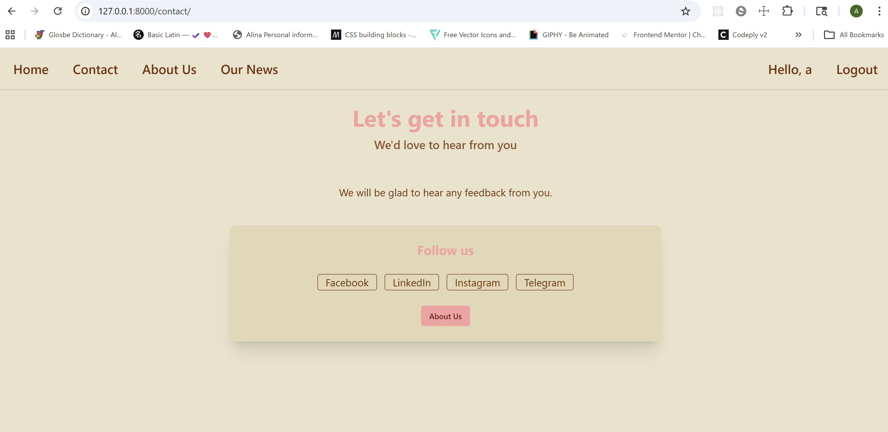
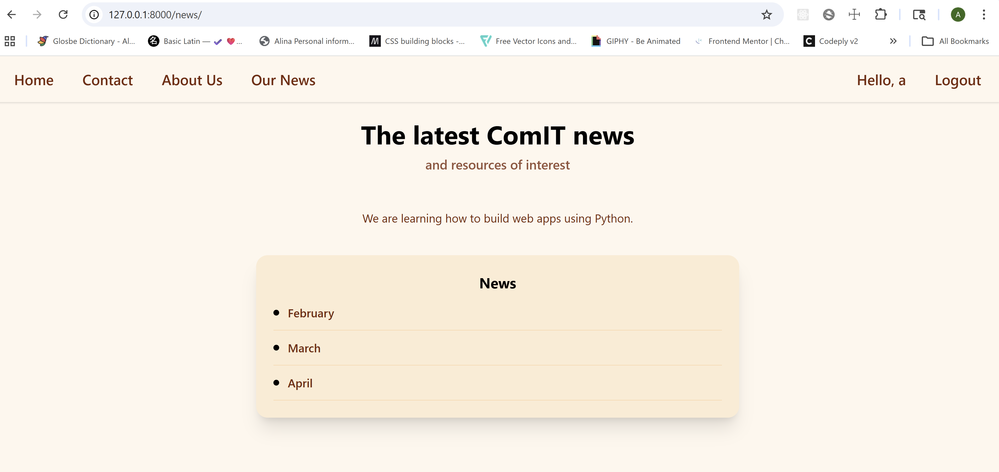

# Django Combined Project — Static Pages with Templates + Authentication

## 📌 Overview

This project is a Django web application that demonstrates how to combine two projects into one: Static Pages with Templates + Authentication.

---

## 🚀 Setup Instructions

### 1. Fork and clone the Static Pages with Templates repository

```bash
git clone <your-forked-repo-url>
cd your-project
```

### 2. Copy the `accounts` app from the Authentication project

```bash
cp -r /path/to/original/accounts /path/to/new/project/accounts
```

### 3. Copy the HTML templates

```bash
cp /path/to/original/templates/login.html     templates/
cp /path/to/original/templates/register.html  templates/
cp /path/to/original/templates/dashboard.html templates/
```

### 4. Update `config/settings.py`

```python
INSTALLED_APPS = [
    'django.contrib.admin',
    'django.contrib.auth',
    'django.contrib.contenttypes',
    'django.contrib.sessions',
    'django.contrib.messages',
    'django.contrib.staticfiles',
    'stat_pgs_tmpl',
    'accounts',  # added
]

TEMPLATES = [
    {
        'BACKEND': 'django.template.backends.django.DjangoTemplates',
        'DIRS': [
            BASE_DIR / 'templates' / 'accounts',
            BASE_DIR / 'templates' / 'stat_pgs_tmpl',],  # modified
        'APP_DIRS': True,
        'OPTIONS': {
            'context_processors': [
                'django.template.context_processors.debug',
                'django.template.context_processors.request',
                'django.contrib.auth.context_processors.auth',
                'django.contrib.messages.context_processors.messages',
            ],
        },
    },
]

# Redirect unauthenticated users to login
LOGIN_URL = '/accounts/login/'
```

### 5. Update `config/urls.py`

```python
from django.contrib import admin
from django.urls import path, include
from stat_pgs_tmpl import views

urlpatterns = [
    path('admin/', admin.site.urls),

    path('', views.home, name='home'),
   
    path('accounts/', include('accounts.urls')),

    path('home/', views.home),
    path('contact/', views.contact),
    path('about/', views.about),
    path('news/', views.news),
]
```

### 6. Run migrations

```bash
python manage.py migrate
```

### 7. Start the development server

```bash
python manage.py runserver
```

---

## 📸 Preview

### Login


### Dashboard


### Home 


### Contact


### About Us


### News

